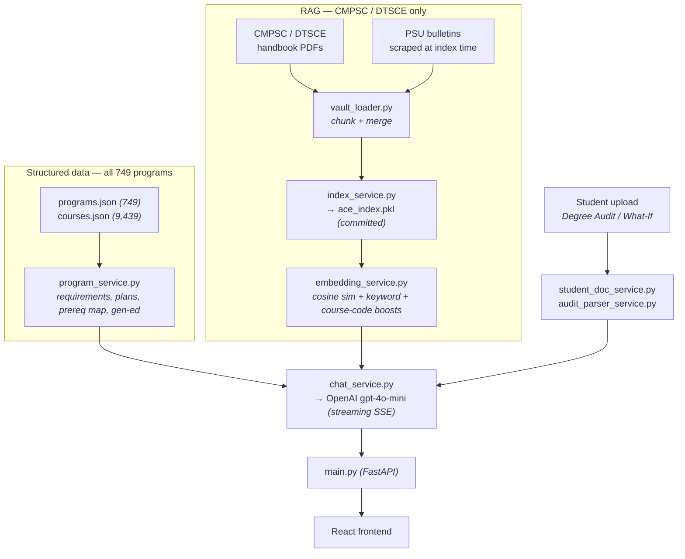

```
   010010110         000101100      101110011001110
011         110   110         101   101
100         110   011               001
101101001011011   011               110000101100
111         011   011               110
110         011   100         110   011
110         100      101001011      011010010110001

01000001 01000011 01000101  ·  A C A D E M I C   C O U N S E L L I N G   E N G I N E
```

<div align="center">

# ACE — Academic Counselling Engine

**An AI academic advisor for Penn State students.**
Ask about courses, requirements, deadlines, and policies — or upload your Degree Audit / What-If report
and get answers grounded in *your* actual progress.

[](https://acecollege.app)


🌐 **[acecollege.app](https://acecollege.app)** (waitlist) · the product runs at `app.acecollege.app`, behind a pilot access gate

</div>

---


## What it does

ACE answers from a structured dataset of all **749** Penn State programs and **9,439** courses,
supplemented by **RAG** over the CMPSC/DTSCE advising handbooks, and combined with **personalized
analysis** of a student's uploaded academic documents. Every major is covered; Computer Science and
Data Sciences get the extra handbook grounding the engine was first built around.

- 💬 **Grounded chat** — streaming answers with intent-aware retrieval
- 📄 **Degree Audit upload** — parsed into credits, remaining requirements, and a suggested plan
- 🧮 **Tools** — GPA calculator, Gen-Ed explorer, prereq map, graduation checklist, academic calendar
- 🎓 **Maggie** — the advisor persona that fronts the product on the landing site

<br clear="right" />

## Contents

- [New here? Start here](#new-here-start-here)
- [Architecture](#architecture) · [Knowledge base](#knowledge-base) · [Intent routing](#intent-routing) · [Student documents](#student-documents)
- [Tech stack](#tech-stack) · [Repository layout](#repository-layout)
- [Getting started](#getting-started) · [Common tasks](#common-tasks)
- [How auth works](#how-auth-works) · [Database](#database) · [Deployment](#deployment)

---

## New here? Start here

**Day-one path, in order:**

1. `git clone https://github.com/digi0/ACE.git && cd ACE`
2. Get your own **OpenAI API key** and **Clerk test keys** (ask Raghav for the shared Clerk dev app, or make your own) → fill `.env` and `frontend/.env` per [Getting started](#getting-started).
3. Run the backend and frontend, ask ACE a question — that round-trip is the whole product in one minute.
4. Read this README top to bottom, then `CLAUDE.md` for the deeper implementation notes.

**Working with Claude Code in this repo:** `CLAUDE.md` at the repo root is loaded automatically at
the start of every session — it carries the architecture, the data flow, the auth pattern, and the
known footguns. You don't need to paste context in; just open the repo and go. If you learn something
non-obvious (a gotcha, a convention), add it to `CLAUDE.md` rather than to a chat message.

**Things that will bite you if nobody tells you:**

| Gotcha | Why |
|--------|-----|
| Don't add a per-field `GET /user/major`-style endpoint | It races `/auth/sync` and breaks major selection — see [How auth works](#how-auth-works) |
| `backend/data/ace_index.pkl` is **committed** | Rebuilding it costs OpenAI embedding calls and re-commits a large binary; only rebuild when handbook/bulletin data actually changed |
| No Alembic migrations | A new non-nullable column needs a manual `ALTER TABLE` on prod Postgres |
| Frontend is **plain CSS**, not Tailwind | `SparklesCore.jsx` was hand-ported for exactly this reason — don't pull in shadcn/Tailwind |
| Never commit `.env`, the SQLite DB, or files under `backend/uploads/` | Real student documents; all gitignored |

---

## Architecture

ACE answers from **two** grounding paths, picked by the student's declared major:



### Knowledge base

**`programs.json` + `courses.json` are the backbone** — 749 programs (prescribed/additional
requirements with min grades, semester-by-semester suggested plans, gen-ed overlap, bulletin URL)
and 9,439 course records. They serve every major and back every tool.

**The RAG index is a CMPSC/DTSCE-only supplement** — 73 records that exist because the handbooks
carry procedural content the bulletins don't (Entrance-to-Major rules, petitions, substitution
process, department contacts):

| `source_type`  | Records | Origin                                       |
|----------------|---------|----------------------------------------------|
| `pdf_handbook` | 47      | CMPSC / DTSCE handbook PDFs (chunked)        |
| `web_bulletin` | 26      | PSU bulletin pages scraped at index time     |

`classify_major()` decides which path runs: `cs` / `ds` majors get RAG + structured, everyone else
(and anyone with no major declared) gets structured only, so CS/DS handbook text can't leak into an
unrelated major's answer. The pre-built index (`backend/data/ace_index.pkl`) is committed so
production deploys skip the cold-start embedding rebuild.

> [!NOTE]
> An `excel_vault` source (`ACE_vlt.xlsx`) was retired in July 2026 — the sheet had no `Content`
> column, so all 13 of its records were empty yet still occupied top context slots.

### Intent routing

`detect_question_intent()` classifies every question — `courses`, `student_progress`, `substitution`,
`etm`, `transfer`, `contact`, `gen_ed`, `deadline`, `wellbeing`, `general`. The intent decides which
sources are prioritized, whether deterministic snippets (deadlines, gen-ed tables, campus resources)
are injected, and — when a student doc is uploaded — routes `student_progress` straight to a
deterministic answer that bypasses the LLM.

### Student documents

Upload → `student_doc_service.py` extracts PDF text → `audit_parser_service.py` parses blocks →
result persisted to the `user_docs` table keyed by Clerk uid. The `/dashboard` endpoint turns that
parse into credit summaries and remaining requirements; the GPA, Gen-Ed, Prereq-Map, and Plan tools
read from it too.

---

## Tech stack

| Layer       | Stack                                                             |
|-------------|-------------------------------------------------------------------|
| Frontend    | React 19 + Vite, plain CSS (design tokens), Clerk, lucide-react    |
| Backend     | FastAPI + Uvicorn, SQLAlchemy, OpenAI SDK, pypdf, BeautifulSoup    |
| Auth        | [Clerk](https://clerk.com) (session-JWT verification server-side)  |
| Model       | OpenAI `gpt-4o-mini` (chat) · `text-embedding-3-small` (index)     |
| Database    | SQLite locally · PostgreSQL in production (via `DATABASE_URL`)     |
| Deploy      | Backend → Railway · Frontend & landing → Vercel                    |

## Repository layout

```
backend/            FastAPI app
  main.py             routes + app wiring
  services/           chat, embeddings, indexing, audit parsing, scrapers, cost
  data/               vault loader, committed index (ace_index.pkl), JSON catalogs
  models.py           SQLAlchemy ORM (users, user_docs, conversations, messages)
  clerk_auth.py       Clerk session-JWT verification
  eval/               retrieval/answer evaluation harness
frontend/           React + Vite single-page app (the product)
landing/            React + Vite waitlist / marketing site (acecollege.app)
*-handbook-*.pdf    CMPSC / DTSCE advising handbooks (RAG source)
requirements.txt    backend Python deps
Procfile            Railway start command
```

---

## Getting started

**Prerequisites:** Python 3.11+, Node 18+, an OpenAI API key, and a Clerk application (test keys are
fine for local dev).

<details open>
<summary><b>Backend</b></summary>

```bash
# from repo root
python -m venv .venv && source .venv/bin/activate
pip install -r requirements.txt

# create .env (see below), then:
uvicorn backend.main:app --reload          # http://127.0.0.1:8000
```

`.env` at the repo root:

```bash
OPENAI_API_KEY=sk-...
CLERK_SECRET_KEY=sk_test_...        # or sk_live_... in prod
LOG_LEVEL=INFO                      # optional
ALLOWED_ORIGINS=...                 # optional CSV; also Clerk authorized_parties (no spaces around commas)
DATABASE_URL=...                    # optional; Railway injects in prod, falls back to SQLite locally
```

</details>

<details open>
<summary><b>Frontend</b></summary>

```bash
cd frontend
npm install
npm run dev                          # Vite dev server
```

`frontend/.env`:

```bash
VITE_CLERK_PUBLISHABLE_KEY=pk_test_...   # or pk_live_... in prod
VITE_API_URL=http://127.0.0.1:8000       # optional, defaults to this
```

</details>

<details>
<summary><b>Landing site (optional)</b></summary>

```bash
cd landing && npm install && npm run dev
```

</details>

## Common tasks

```bash
# Rebuild the vector index (after changing vault / handbook / bulletin data)
python -c "from backend.services.index_service import build_index; build_index()"

# Refresh the PSU academic calendar JSON
python -m backend.services.calendar_scraper

# Estimate OpenAI cost for N users / M messages
python -m backend.scripts.estimate_cost --users 100 --msgs 20

# Backend self-checks (plain asserts / print scripts — no pytest)
python -m backend.test_routing     # major classification + record selection
python -m backend.test_rules       # dumps extracted requirement rules

# Frontend
cd frontend && npm run build      # production build
cd frontend && npm run lint       # eslint
```

---

## How auth works

Clerk is the single source of truth. The frontend `<ClerkProvider>` wraps the app; `AuthContext.jsx`
is a thin shim over Clerk's hooks. On login, the **one** round-trip is `POST /auth/sync` — it upserts
the user row (pulling email + name from the Clerk users API) and returns `{ major, has_doc }` so the
UI hydrates without a second request. The backend verifies session JWTs with the official
`clerk-backend-api` SDK; `get_current_user` returns `{ uid }` (the `sub` claim).

> [!WARNING]
> All post-login state piggybacks on the `/auth/sync` response **by design**. Adding a separate
> per-field GET that fires on user-state-change will race against `sync` and break the
> major-selection flow.

## Database

SQLAlchemy ORM (`backend/models.py`); `backend/database.py` picks SQLite locally and PostgreSQL on
Railway. Tables: `users` (keyed by Clerk uid), `user_docs` (uploaded audit, one per user), and
`conversations` + `messages` (chat history). Schema is created at startup via
`Base.metadata.create_all`.

> [!NOTE]
> No Alembic migrations are wired up yet — adding a non-nullable column to prod Postgres needs a
> manual `ALTER TABLE` or Alembic.

## Deployment

- **Backend** → Railway (`Procfile`: `uvicorn backend.main:app`). The committed index avoids the
  build-time embedding rebuild.
- **Frontend & landing** → Vercel (separate projects; `frontend/vercel.json` is SPA-fallback only).
- Set production secrets as environment variables on each platform — never commit `.env`, the local
  SQLite DB, or uploaded documents (all gitignored).

---

<div align="center">


*ACE is an independent student project and is not officially affiliated with or endorsed by
The Pennsylvania State University. Always confirm academic decisions with a human advisor.*

</div>
